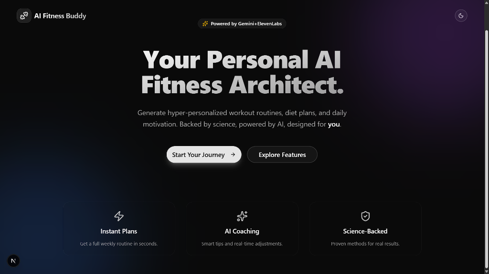
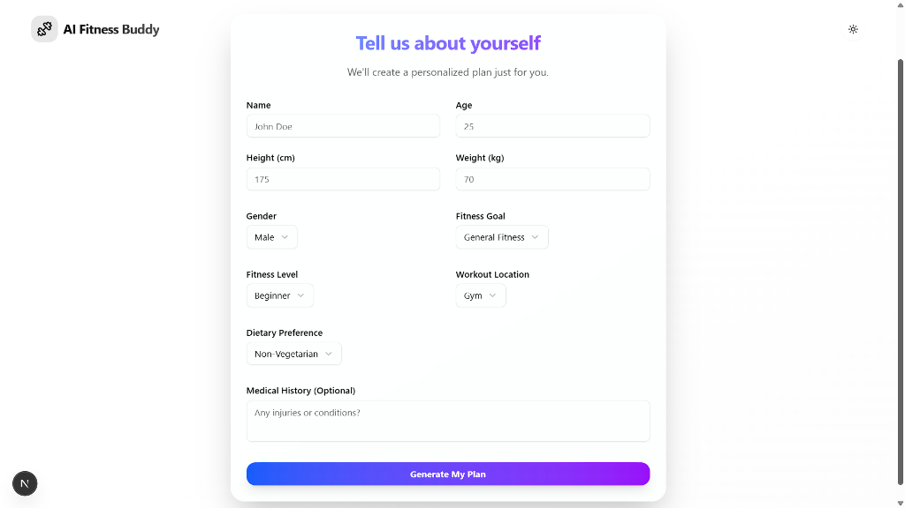
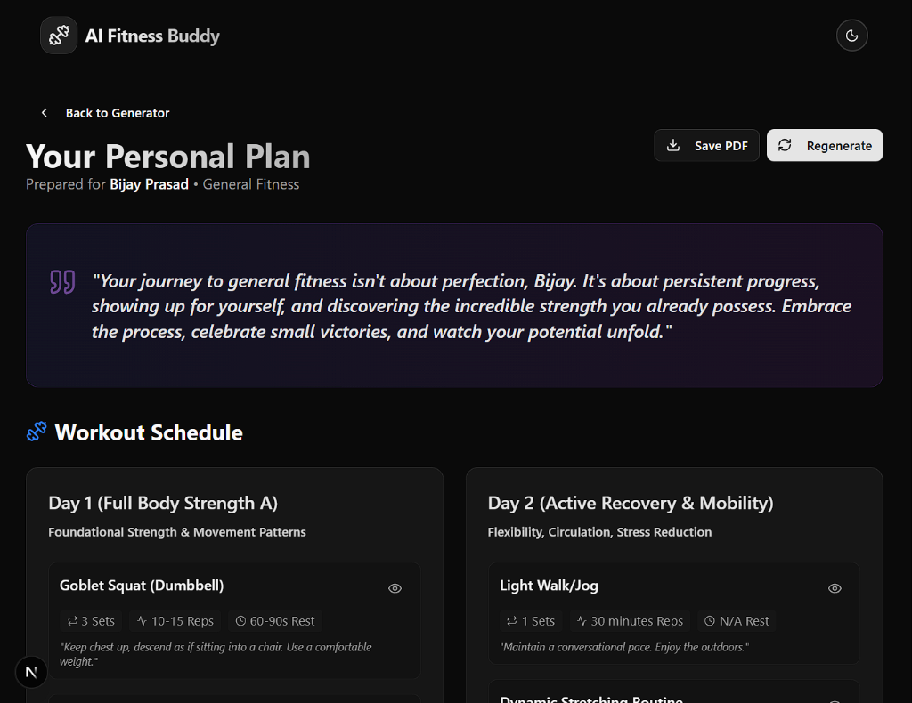
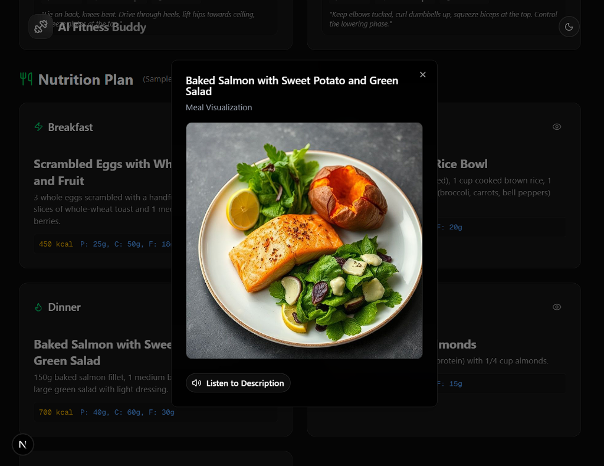
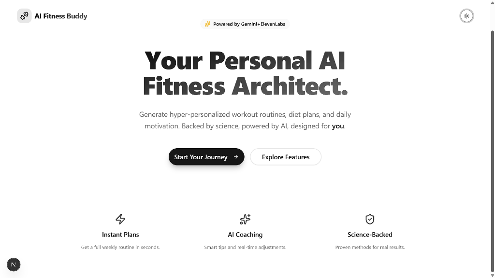

# 🏋️‍♂️ AI Fitness Buddy

**Your Personal AI Fitness Architect.**

AI Fitness Buddy is a next-generation fitness application that generates hyper-personalized workout and diet plans using the power of **Gemini 1.5 Pro**. It combines cutting-edge AI, a premium "Magic UI" design, and rich media features like Text-to-Speech and AI Image Visualization to create an immersive fitness experience.



## ✨ Features

-   **🧠 Smart Plan Generation**: Powered by **Gemini 1.5 Pro** (with fallbacks to OpenAI/Claude), creating scientifically backed routines tailored to your age, goal, and fitness level.
-   **🎨 AI Visualizations**: Automatically generates mouth-watering food images and workout diagrams using a robust multi-model chain (**Gemini Nano**, Replicate, Pollinations.ai).
-   **🗣️ AI Voice Coach**: Narrates your daily plan using **ElevenLabs** for a hands-free experience.
-   **🏋️‍♂️ Gym Pulse Loader**: Custom, gym-themed loading animations that replace boring spinners.
-   **📱 Responsive & Adaptive**: Vertically stacked, mobile-first layouts that look stunning on any device.
-   **🌗 Dark & Light Mode**: A fully completely redesigned theme system. Dark mode features deep, neon accents, while Light mode offers a clean, high-contrast professional look.
-   **⚡ Local Persistence**: Your plans are auto-saved locally so you never lose progress.
-   **📄 PDF Export**: Download your complete weekly routine as a PDF with one click.

## 📸 Screenshots

### **Interactive Form**
*Smooth, glassmorphism-styled inputs with "Spotlight" effects.*


### **Your Personal Plan**
*Comprehensive dashboard showing daily workouts and nutrition.*


### **Visualized Nutrition**
*AI-generated previews of your recommended meals.*


### **Light Mode**
*Clean, accessible, and professional.*



## 🛠️ Tech Stack

-   **Frontend**: [Next.js 14](https://nextjs.org/) (App Router), [React 19](https://react.dev/)
-   **Language**: [TypeScript](https://www.typescriptlang.org/)
-   **Styling**: [Tailwind CSS v4](https://tailwindcss.com/), [Shadcn UI](https://ui.shadcn.com/), [Framer Motion](https://www.framer.com/motion/)
-   **State Management**: [Zustand](https://github.com/pmndrs/zustand)
-   **AI & Backend**:
    -   **LLM**: Google Gemini 1.5 Pro (via `@google/genai`)
    -   **Image Gen**: Replicate / Gemini Imagen 3 / HuggingFace
    -   **TTS**: ElevenLabs API

## 🚀 Getting Started

1.  **Clone the repository**:
    ```bash
    git clone https://github.com/yourusername/ai-fitness-buddy.git
    cd ai-fitness-buddy
    ```

2.  **Install dependencies**:
    ```bash
    npm install
    ```

3.  **Configure Environment**:
    Create a `.env.local` file in the root directory:
    ```env
    GEMINI_API_KEY=your_gemini_key
    REPLICATE_API_TOKEN=your_replicate_key (optional)
    ELEVENLABS_API_KEY=your_elevenlabs_key (optional)
    HUGGINGFACE_API_TOKEN=your_hf_key (optional)
    ```

4.  **Run the development server**:
    ```bash
    npm run dev
    ```

5.  Open [http://localhost:3000](http://localhost:3000) in your browser.

## 🤝 Contributing

Contributions are welcome! Please feel free to submit a Pull Request.

---

*Built with ❤️ by [Bijay Prasad]*
